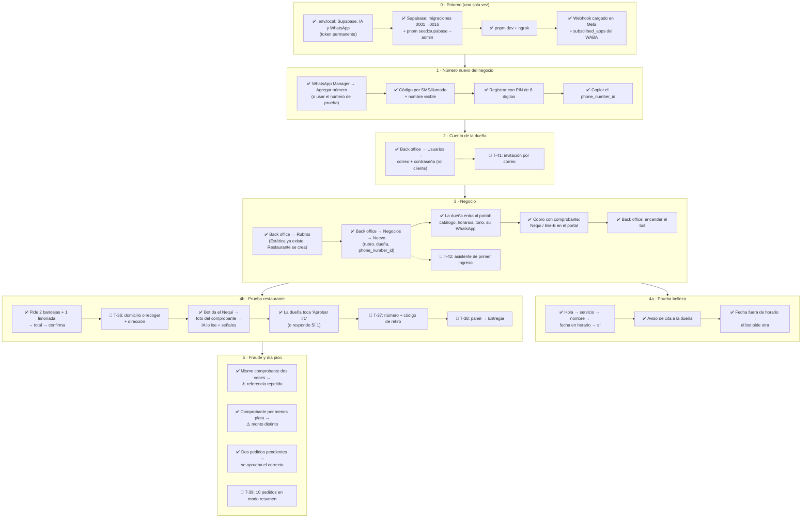

# 17 - Prueba local de punta a punta (antes de vender)

> Recorrido completo, con datos de ejemplo, para correr en local **antes de mostrarle Nexo
> a cualquier cliente**: desde que se agrega un número nuevo hasta que un cliente agenda
> una cita o hace un pedido y la dueña lo aprueba.
>
> **Estado de esta guía:** versión 1 (oct-2026). Describe lo que funciona **hoy**.
> Los pasos marcados 🔧 dependen de una tarea del backlog (T-30 a T-43, ver
> `docs/14-plan-de-trabajo.md`). Cada PR de esas tareas actualiza su paso acá: la meta
> es recorrer el diagrama entero sin tocar código ni la base a mano.

Leyenda: ✅ funciona hoy · 🔧 requiere la tarea indicada · ⚙️ hoy se puede, pero a mano.

---

## Diagrama del recorrido



---

## Datos de ejemplo

| | Belleza | Restaurante |
|---|---|---|
| Rubro | Estética (sembrado) | Restaurante (se crea en el paso 3.1) |
| Negocio | Estética Bella Cúcuta | Sabores del Sur |
| Dueña (login) | `duena.belleza@prueba.co` | `duena.sabores@prueba.co` |
| Catálogo | Limpieza facial $80.000 · 60 min · Manicure $25.000 · 45 min | Bandeja paisa $28.000 · stock 20 · Limonada de coco $8.000 · stock 30 |
| Horario | Lun-Sáb 9:00-18:00 | Todos los días 11:00-22:00 |
| Pago | — | Nequi 300 000 0000 (ejemplo) · pedir comprobante |

**Los tres celulares de la prueba:**

| Rol | Qué es | Regla |
|---|---|---|
| Negocio | El número de prueba de Meta o una SIM nueva | Es el que atiende el bot |
| Cliente | Tu celular | Le escribe al número del negocio |
| Dueña | Otro celular (un familiar) | **Distinto** del número del negocio: ahí le llegan los avisos para aprobar |

Con el número de prueba de Meta, el cliente y la dueña tienen que estar agregados como
**destinatarios** en la consola de la app (WhatsApp → Configuración de la API → "Para").

Con un solo número se prueba **un negocio a la vez**: se mueve el `phone_number_id` de un
negocio al otro desde el back office. La variante que no tiene número se puede probar
igual con el simulador: `pnpm sim --business <slug>`.

---

## Paso 0 · Entorno (una sola vez)

1. **`.env.local`** con las variables de `.env.example`:
   - WhatsApp: `WHATSAPP_VERIFY_TOKEN`, `WHATSAPP_ACCESS_TOKEN` (el **permanente**, ver
     §9 de `05-whatsapp-setup.md`) y `WHATSAPP_APP_SECRET`.
   - IA: al menos `GEMINI_API_KEY`.
   - Supabase: `NEXT_PUBLIC_SUPABASE_URL`, `NEXT_PUBLIC_SUPABASE_ANON_KEY` y
     `SUPABASE_SERVICE_ROLE_KEY`.
2. **Supabase:** en el SQL Editor, correr **todas** las migraciones de
   `supabase/migrations/` en orden (de `0001` a `0016`). Después:
   ```bash
   pnpm seed:supabase --admin tucorreo@dominio.com TuClave123
   ```
   - Debe crear el rubro "Estética", el negocio demo y tu usuario administrador.
   - Si falla con `ENOTFOUND ...supabase.co`, la URL del proyecto está mal o el proyecto
     está pausado. Ver §8 de `05-whatsapp-setup.md`.
3. **Levantar:** `pnpm dev` en una terminal y `ngrok http 3000` en otra.
4. **Webhook en Meta:** URL `https://<tu-dominio>.ngrok-free.dev/api/webhook/whatsapp`
   y el mismo verify token del `.env.local`. Hacer **una vez por cuenta de WhatsApp**
   el `subscribed_apps` (§8 de `05-whatsapp-setup.md`).

**Qué tiene que pasar:** entrás a `http://localhost:3000/login` con tu correo de admin y
caés en `/backoffice`.

## Paso 1 · Número nuevo del negocio

- **Con el número de prueba:** ya existe. Copiá su `phone_number_id` en WhatsApp →
  Configuración de la API.
- **Con una SIM nueva:**
  1. WhatsApp Manager → Números de teléfono → **Agregar número**.
  2. Cargar el nombre visible (el nombre del negocio) y verificar con el código por
     SMS o llamada.
  3. Registrar el número para la API con un PIN de 6 dígitos que elegís vos:
     ```powershell
     curl.exe -X POST "https://graph.facebook.com/v21.0/<PHONE_NUMBER_ID>/register" `
       -H "Authorization: Bearer <TOKEN>" -H "Content-Type: application/json" `
       -d '{\"messaging_product\":\"whatsapp\",\"pin\":\"123456\"}'
     ```
     Respuesta esperada: `{"success":true}`. Guardá el PIN, Meta lo vuelve a pedir si se
     re-registra el número.
  4. Copiar el `phone_number_id`.

> Sin verificación del negocio en Meta, la cuenta admite **2 números**. Para el tercero
> hace falta verificar Nexo (ver `docs/14-plan-de-trabajo.md`).

## Paso 2 · Cuenta de la dueña

**Hoy (✅):**
1. Back office → **Usuarios**.
2. Cargar correo (`duena.sabores@prueba.co`), una contraseña de 8 o más caracteres y el
   rol **cliente**.
3. Pasarle la contraseña a la dueña. No se manda ningún correo.

**Qué tiene que pasar:** el usuario aparece en la lista con rol cliente.

🔧 **T-41** la reemplaza por "Invitar dueña": le llega un correo y ella define su
contraseña. También agrega "olvidé mi contraseña".

## Paso 3 · Negocio

### 3.1 Rubro (solo para restaurante, una vez)

El rubro "Estética" ya viene sembrado. Para el restaurante:
1. Back office → **Rubros** → Nuevo: slug `restaurante`, nombre "Restaurante".
2. Abrir el rubro y, en la sección de catálogo de la plantilla:
   - etiqueta "Plato" / "Menú";
   - camino por defecto **pedido**;
   - mostrar el campo stock y ocultar la duración.
3. Guardar.

🔧 **T-40** deja sembrados los cuatro rubros base (Belleza, Peluquería, Masajes,
Restaurante) ya configurados.

### 3.2 Crear el negocio

1. Back office → **Negocios** → Nuevo.
2. Cargar nombre, rubro, la dueña del paso 2 y el `phone_number_id` del paso 1.
3. El negocio nace con el bot **apagado**.

**Qué tiene que pasar:** el negocio aparece con la etiqueta "Pausado".

🔧 **T-42:** la dueña lo crea ella misma en su primer ingreso, eligiendo el tipo.

### 3.3 La dueña configura (desde el portal)

Cerrar sesión, entrar con el usuario de la dueña y abrir el negocio:
- **Catálogo:** los servicios o platos de la tabla de ejemplo, con precio (y stock en el
  restaurante).
- **Citas/Horarios:** días y horas de atención. En belleza, cada servicio marcado como
  reservable.
- **Configuración:**
  - su WhatsApp personal (formato `573001234567`): ahí le llegan los avisos;
  - el tono del bot (Cercano, Neutral o Formal);
  - lo que el bot debe saber (dirección, medios de pago, políticas).

**Cobro con comprobante (restaurante):** en Configuración → **Cobro con comprobante**:
- activar "Pedir comprobante antes de aprobar";
- cargar el número de Nequi, la llave Bre-B si la hay y el nombre del titular.

El bot le manda esos datos al cliente al confirmar el pedido. El número de Nequi también
sirve para avisar si el comprobante dice que se pagó a otro número.

### 3.4 Encender el bot

Volver como admin → Negocios → el negocio → **Activar bot**.

**Qué tiene que pasar:** la etiqueta pasa a "Activo".

## Paso 4a · Prueba belleza

Desde el celular "cliente", escribirle al número del negocio:

| Cliente escribe | El bot debería |
|---|---|
| `Hola` | Saludar y mostrar los servicios |
| `limpieza facial` | Mostrar precio y duración y pedir el nombre |
| `Laura` | Pedir día y hora |
| `el sábado a las 11` | Pedir confirmación con la fecha real |
| `sí` | Confirmar la cita |

**La dueña** recibe en su WhatsApp el aviso de la cita nueva.

**Variante:** pedir `el domingo a las 8`. El bot avisa que está cerrado y pide otra fecha.

## Paso 4b · Prueba restaurante

| Cliente escribe | El bot debería |
|---|---|
| `Hola, ¿qué tienen?` | Mostrar el menú con precios |
| `bandeja paisa` | Pedir el nombre |
| `Laura` | Preguntar cuántas |
| `2` | "¿Querés agregar algo más a tu pedido?" |
| `limonada de coco` | Preguntar cuántas |
| `1` | Volver a preguntar si quiere algo más |
| `no, eso es todo` | Mostrar el resumen con total $64.000 y pedir confirmación |
| `sí` | Descontar stock, darle el Nequi / la llave Bre-B y pedir la foto del comprobante |
| *(foto de un comprobante de Nequi por $64.000)* | "Recibí tu comprobante…" |

Con la IA en modo agente el bot puede juntar pasos: si el cliente escribe
`2 bandejas paisas y una limonada`, debería armar el carrito de una. Lo que importa es el
resultado (el resumen con el total correcto), no la cantidad de mensajes.

**La dueña** recibe "pedido #1 nuevo, esperando tu aprobación" con:
- el resumen;
- los datos del comprobante y las ⚠️ señales, si las hay;
- el recordatorio de revisar su app del banco;
- los botones **Aprobar #1** / **Rechazar #1**.

Toca **Aprobar #1** (o escribe `SÍ 1`) y el cliente recibe la confirmación.

**En Supabase**, la tabla `pedidos` tiene el #1 con sus ítems y su estado:
`esperando_pago` → `por_verificar` (llegó el comprobante) → `aprobado`. El comprobante
queda vinculado (`comprobante_id`) y también pasa a `aprobado`.

Lo que todavía no pasa:
- 🔧 **T-36:** no pregunta domicilio o recoger en un pedido ni pide la dirección.
- 🔧 **T-37 y T-38:** el pedido ya tiene número, pero todavía no hay código de retiro ni
  panel.
- Si la dueña rechaza (`NO 1`), las unidades vuelven al stock. Un pedido que espera el
  pago más de 24h vence solo y también devuelve su stock; uno con comprobante nunca
  vence solo.

## Paso 5 · Fraude y día pico

| Prueba | Cómo | Qué tiene que pasar |
|---|---|---|
| Referencia repetida ✅ | Hacer dos pedidos y mandar **la misma** foto de comprobante | El segundo aviso a la dueña trae ⚠️ "La referencia … ya se usó antes" |
| Monto distinto ✅ | Pedido de $64.000 y comprobante de $30.000 | ⚠️ con los dos montos |
| Comprobante viejo ✅ | Comprobante de hace dos días | ⚠️ fecha vieja |
| Dos pedidos a la vez ✅ | Pedido #1 desde un celular y #2 desde otro; la dueña toca "Aprobar #2" | Se aprueba solo el #2; el #1 sigue esperando |
| "SÍ" suelto con dos pendientes ✅ | La dueña escribe solo `sí` | El bot no aprueba nada y le lista "#1 … · #2 …" pidiendo el número |
| Día pico 🔧 T-39 | 10 pedidos con el aviso en modo resumen | Un solo aviso con link al panel |

---

## Dónde mirar si algo no pasa

| Síntoma | Dónde mirar |
|---|---|
| El bot no contesta | Terminal de `pnpm dev`, después el inspector de ngrok (`http://127.0.0.1:4040`): ¿llegó el POST de Meta? |
| No llega nada a ngrok | `subscribed_apps` del WABA (§8 de `05-whatsapp-setup.md`) |
| Error 401 / código 190 | Token vencido: usar el permanente (§9) |
| "No hay negocio para el phone_number_id" | El `phone_number_id` del negocio en el back office no coincide con el del número |
| La dueña no recibe avisos | Su WhatsApp en Configuración, en formato `57…`, y distinto del número del negocio |
| Datos raros | Tablas `negocios`, `leads` y `comprobantes` en Supabase |
